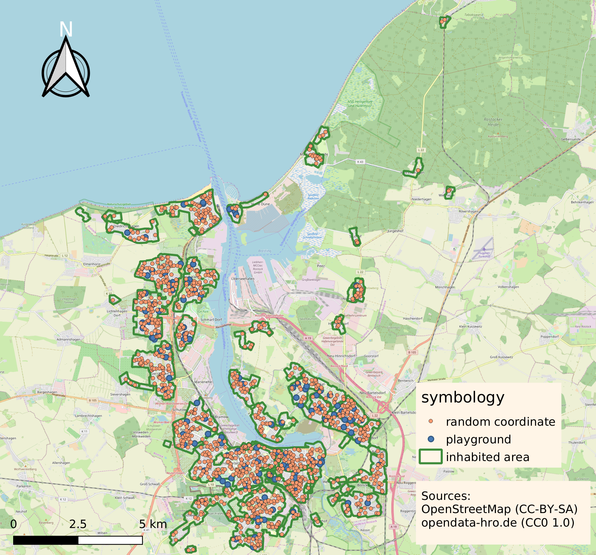

# playground-distance

An example in geoinformatics. The program calculates the average distance of a
resident to the nearest playground within his city. In this example open data from the
city of [Rostock](https://en.wikipedia.org/wiki/Rostock) is used.

## Sources and Services

The program uses the following sources and services.

1. *Anthropogene Überprägung der Konzeptbodenkarte 2018*
[(areas of Rostock where people live)](https://geo.sv.rostock.de/download/opendata/konzeptbodenkarte_2018/konzeptbodenkarte_2018_anthropogene_ueberpraegung.json)

2. *Gerätespielanlagen* [list of playgrounds](https://geo.sv.rostock.de/download/opendata/geraetespielanlagen/geraetespielanlagen.csv)

3. Direction API from 
[openrouteservice.org](https://openrouteservice.org/dev/#/api-docs/directions/get)

## Method

The script `average-distance.py` simulates according to the following method.

1. Generation of random coordinates (uniform distribution) within the city limits.

2. Saving those coordinates that are within an inhabited are.

3. For each random coordinate: calculate the three nearest playgrounds (euclidean distance)

4. Using [openrouteservice](https://openrouteservice.org/services/) to calculate the
actual distance (on foot) in meter of these three points.

5. Save the nearest random coordinate and the corresponding distance in `results.csv`.
(Maybe you want to run `average-distance.py` more than once, due to the
api restrictions of openrouteservice.org)

6. Calculate the average distance with `calc-average-from-csv.py`

7. Using QGIS to visualize the coordinates and the ares on a map.

## Run the Simulation

...
